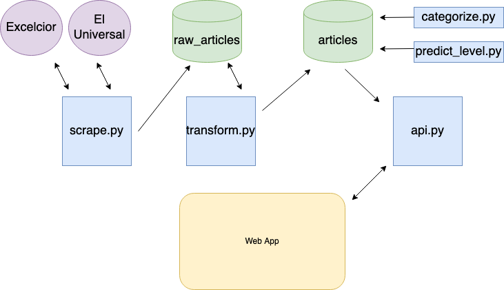

# Spanish Connection (News Recommender Engine)
This project aims to scrape high quality news sources in the Spanish speaking world and provide recommendations via an API endpoint. This is my final project as a student in the Iron Hack Data Analytics Bootcamp (Mexico City) January 2020-March 2020.

# Classification model

A logistic regression model was trained on 7.3k news articles from web page https://www.practicaespanol.com/noticias/. These articles are ranked according to their linguistic complexity following the European CEFR scale. The model reached 76% accuracy on 20% test data set. The model was trained and evaluated in the file `bag_of_words_logistic_regression.ipynb`. Text was preprocessed with the linguistic transformer class (see below).

# Pipeline for web application
The following diagram illustrates the different steps in the pipeline to provide data to the API end point.

# Scraping
To scrape news articles, the most relevant scraper is `daily_scraper` which is contained in the file `scrape.py`. Objects pertaining to this class are initiated with URLs of RSS pages which are hard coded into the file `rss_feeds.py`. The file `scrape_program.py` instantiates these objects thus initiating the daily scraping.

# Linguistic transformer
The linguistic transformer class contained in the file `transformer.py` receives raw data from articles and processes them: tokenization, lemmatization, and removal of stop words. This class creates a bag-of-words associated for each article which allows the article to classified according to its linguistic complexity (see above).

# Linguistic classification and categorization.
The preprocessed articles are stored in a second database (represented by `articles` in the diagram above). Currently the classification algorithm supports two levels (beginner and advanced). For now this functionality is implemented in the file `predict_linguistic_level.ipynb`. Subsequently, each article receives a category which is either derived from the URL of the article or the XML subpage from which it was taken, this functionality was implemented in the files `assign_category.ipynb` and `derive_categories.ipynb`.

# Api
The API endpoint is contained in the class `app.py`. This endpoint receives only a user_id, looks up the linguistic level and preferred categories of the user, then articles matching these characteristics are returned in a JSON format.